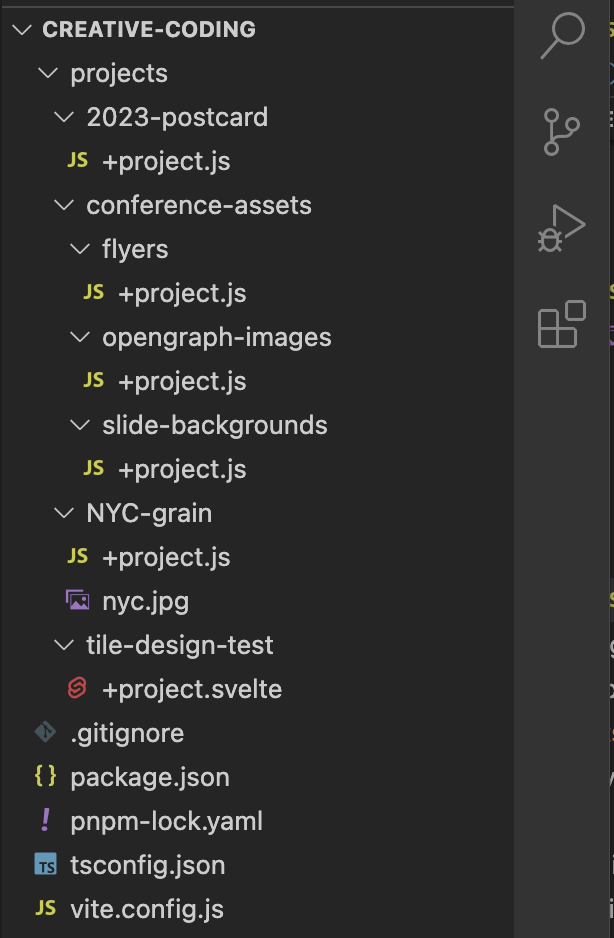

**Daniel’s Creative Coding Toy** (name TBD) is a development tool for designing images with Canvas, P5.js, Three.js and Svelte. It provides hot reloading, a GUI for inputs, an opinionated workflow and a conventional file structure.

**Based on Svelte:** the GUI is a SvelteKit app that’s used as a Vite middleware. It also supports projects built in Svelte which is useful for working with SVGs.

Example file structure:

This results in a UI like this: https://vimeo.com/818521419

---

This is an early POC written for the Svelte Hackathon. It supports:

- Static projects with Canvas, Svelte, P5.js and Three.js
- Basic inputs using Tweakpane
- An experimental transformer that converts P5 scripts to instance-mode modules

Only tested on Mac OSX.
